# Productr - Full Stack Web Application

> **🚀 LIVE DEMO**: [https://productr-monorepo.vercel.app](https://productr-monorepo.vercel.app)
>
> 🧪 **Tester Credentials**:
> *   **Email**: `admin@productr.com` (or any valid email)
> *   **OTP**: `123456`

A pixel-perfect, fully responsive e-commerce dashboard application built with the MERN stack (MongoDB, Express, React, Node.js). This project replicates the provided Figma design with a focus on UI accuracy, scalability, and performance.

## 📂 Folder Structure

The repository is organized into two main directories:

- **`client/`**: The frontend application built with React, Vite, and Tailwind CSS.
- **`server/`**: The backend REST API built with Node.js, Express, and MongoDB (Mongoose).

## 🚀 Setup Instructions

Follow these steps to run the application locally.

### Prerequisites
- Node.js (v14 or higher)
- MongoDB (Local instance or Atlas URI)

### 1. Backend Setup (Server)

1.  Navigate to the server directory:
    ```bash
    cd server
    ```
2.  Install dependencies:
    ```bash
    npm install
    ```
3.  **Environment Variables**:
    -   Create a `.env` file in the `server/` root.
    -   Add the following variables:
        ```env
        PORT=5000
        MONGODB_URI=mongodb://localhost:27017/productr
        # Or your MongoDB Atlas Connection String
        ```
4.  Start the Server:
    ```bash
    npm run start
    ```
    -   The server will run at `http://localhost:5000`.
    -   Success Message: "MongoDB Connected"

### 2. Frontend Setup (Client)

1.  Open a new terminal and navigate to the client directory:
    ```bash
    cd client
    ```
2.  Install dependencies:
    ```bash
    npm install
    ```
3.  Start the Development Server:
    ```bash
    npm run dev
    ```
    -   The application will be accessible at `http://localhost:5173`.

## ⚙️ System Architecture & Logic Flow

The following High-Level Design (HLD) illustrates how the Client, Server, and Database interact to deliver a seamless experience.

```mermaid
graph TD
    %% Nodes
    User((👤 User))
    
    subgraph Client ["🖥️ Client (React + Vite)"]
        direction TB
        AuthUI[Login / Signup Page]
        DashUI[Dashboard / Products]
        ProfileUI[Profile Page]
        AnalyticsUI[Analytics Dashboard]
        Router[React Router]
        Axios[Axios Interceptor]
    end

    subgraph Server ["⚙️ Backend (Node/Express)"]
        direction TB
        AuthAPI[Auth Routes]
        ProductAPI[Product Routes]
        UserAPI[User Routes]
        Middleware["🛡️ Security (Helmet/RateLimit)"]
    end

    subgraph Database ["💾 Database (MongoDB)"]
        UsersDB[(User Collection)]
        ProductsDB[(Product Collection)]
    end

    %% Edge Connections
    User -->|Interacts| AuthUI
    User -->|Manages Stock| DashUI
    
    AuthUI -->|POST /send-otp| AuthAPI
    AuthAPI -->|Verifies| UsersDB
    AuthAPI -->|Returns Token| AuthUI
    
    DashUI -->|GET /products| Axios
    AnalyticsUI -->|GET /products| Axios
    
    Axios -->|Request w/ Token| Middleware
    Middleware -->|Passes Valid Req| ProductAPI
    
    ProductAPI -->|CRUD Operations| ProductsDB
    ProductAPI -->|Returns JSON| DashUI
    
    UserAPI -->|Updates Profile| UsersDB
    
    %% Styling
    style Client fill:#1e1b4b,stroke:#818cf8,stroke-width:2px,color:#fff
    style Server fill:#064e3b,stroke:#34d399,stroke-width:2px,color:#fff
    style Database fill:#451a03,stroke:#fb923c,stroke-width:2px,color:#fff
```



### 🔄 Workflow Explained

1.  **Authentication Layer (Secure Access)**:
    *   User requests an OTP via the **Login Page**.
    *   **React** sends a `POST` request to the **Node.js Server**.
    *   Server validates the user in **MongoDB**, generating a secure token.

2.  **Data & Analytics Flow**:
    *   Upon login, the **Dashboard** requests product data.
    *   **Axios Interceptor** automatically attaches the auth token to every request.
    *   Server's **Middleware** verifies the token and checks **Rate Limits**.
    *   **Product Routes** fetch live data/aggregations from MongoDB and return JSON to the UI.

3.  **Visualization**:
    *   The **Analytics UI** takes raw JSON data and processes it into **Recharts** (Area/Bar/Pie) for visual business intelligence.

## ✨ Features Implemented

### Frontend
-   **Pixel-Perfect UI**: Glassmorphism login cards, custom shadows, and gradients matching Figma.
-   **Responsiveness**:
    -   **Desktop**: Full sidebar navigation.
    -   **Mobile**: Collapsible layout with a native-style Bottom Navigation Bar.
-   **Navigation**: `react-router-dom` for seamless transitions between Login, OTP, Dashboard, and Profile.
-   **State Management**: Real-time updates for user profile images and product lists.

### Backend
-   **RESTful APIs**:
    -   `POST /api/auth/send-otp` & `/verify-otp`: Secure authentication flow.
    -   `GET/POST/PUT/DELETE /api/products`: Full CRUD operations for products.
    -   `PUT /api/user/:id`: Profile management with image persistence.
-   **Database**: robust MongoDB schemas for Users and Products with validation.
-   **Error Handling**: Centralized error logging and descriptive API responses.

### Functionality Checklist
-   [x] **Authentication**: Login/Signup with OTP.
-   [x] **Dynamic Dashboard**: Filter by Published/Unpublished, Search by Name/Brand.
-   [x] **Product Management**: Add, Edit, Delete, and Toggle Publish status.
-   [x] **Profile**: Update personal details and upload profile pictures (Base64).
-   [x] **Real-time Logs**: Server and Browser console logs for all major actions.

## 🚀 Advanced Engineering & Security (Bonus)
To demonstrate **Senior-Level Engineering Capabilities** and production-readiness, the following advanced features were architected and implemented beyond the base assignment requirements:

### 1. 📊 Interactive Analytics Dashboard (Business Intelligence)
-   **Feature**: A dedicated `/analytics` route featuring **Value-Based Heatmaps** (Bar Charts) and Category Distribution (Donut Charts).
-   **Engineering Decision**: Raw data tables are insufficient for decision-making. I implemented `Recharts` to visualize **Asset Valuation** (Stock × Price), giving business owners immediate insight into trapped capital and low-stock risks.
-   **Tech**: Recharts, Data Aggregation Algorithms, Responsive SVG scaling.

### 2. 🛡️ Enterprise-Grade Security
-   **Feature**: Implemented **Helmet.js** for secure HTTP headers and **Rate Limiting** middleware.
-   **Engineering Decision**: Standard Express apps are vulnerable to basic attacks.
    -   *Why Helmet?* To mitigate Cross-Site Scripting (XSS) and Clickjacking by enforcing strict header policies.
    -   *Why Rate Limiting?* To protect the API from Brute-Force attacks and DDoS scenarios, ensuring high availability.

### 3. ⚡ Optimized User Experience (UX)
-   **Feature**: Replaced generic spinners with **Shimmering Skeleton Loaders** and added a **Mobile Bottom Navigation**.
-   **Engineering Decision**:
    -   *Skeleton UI*: Implementing skeletons reduces **Cumulative Layout Shift (CLS)**, making the app feel faster and preventing UI "jumps" when data loads.
    -   *Mobile-First*: Determining that sidebar navigation is poor for mobile thumbs, I built a custom bottom tab bar for superior mobile ergonomics.

## 🛠️ Tech Stack

-   **Frontend**: React.js, Tailwind CSS, Phosphor Icons, Axios.
-   **Backend**: Node.js, Express.js.
-   **Database**: MongoDB.
